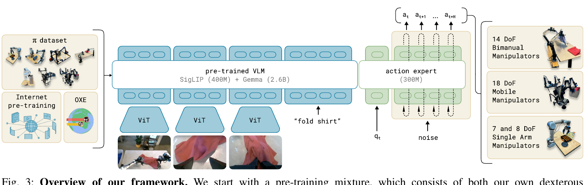

# π0：Vision-Language-Action Flow Model 学习笔记

> [!note] Dynamic Note
> 本笔记随实际学习进度更新。当前只展开已经讲解和问答过的内容；`Learning Roadmap` 中的后续目标只用于导航。论文读完时，笔记同步完成。

## Paper Information

- 论文：*π0: A Vision-Language-Action Flow Model for General Robot Control*
- 本地来源：`/Users/nyvo/paper/π0.pdf`
- 核心问题：如何让一个视觉—语言—动作模型（Vision-Language-Action Model, VLA）根据视觉观察、语言任务和机器人自身状态，生成可执行的连续机器人动作。

## Paper Understanding Map

- **Problem**：传统视觉—语言—动作策略往往依赖离散动作词元或单一机器人数据，难以同时处理连续、协调的控制和跨平台泛化。
- **Core claim**：π0 将预训练视觉—语言模型与动作专家结合，并用条件流匹配生成连续动作块，从而在多任务、多机器人数据上形成通用机器人控制策略。
- **Mechanism**：图像和语言提供任务与场景上下文；机器人状态、带噪动作块和流时间进入动作专家；Euler 积分把噪声逐步变成可执行动作。
- **Evidence**：预训练、后训练、跨机器人统一接口和高层语言策略共同构成系统；实验通过直接测试、语言条件比较和后训练结果检验这些主张。
- **Boundary**：实验结论主要适用于论文训练和评测覆盖的机器人、任务与数据分布；系统级比较不能单独证明每个组件的因果贡献，也不等于对任意未知机器人零样本泛化。

## Learning Objectives

1. 说清 π0 要解决的问题、输入输出与控制循环。
2. 理解条件流匹配（conditional flow matching）如何生成连续动作块（action chunk）。
3. 理解视觉—语言模型（Vision-Language Model, VLM）主干与动作专家（action expert）的分工和连接方式。
4. 理解预训练（pre-training）、后训练（post-training）和跨机器人数据混合（cross-robot data mixture）。
5. 理解语言输入与高层策略（high-level policy）如何支持长时程任务。
6. 能阅读实验与消融研究（ablation study），判断 π0 的贡献、证据与局限。

## Learning Roadmap

先建立 π0 的输入、输出和训练范式（training paradigm），再理解条件流匹配如何生成动作；随后进入模型架构、数据与训练流程，再介绍语言条件下的高层策略，最后用实验结果检验论文主张。每个 `Objective` 都会根据理解需要，通过概念讲解、`Check Your Understanding`、`Answer` 和必要追问逐步完成。

## Objective 1: 问题、输入输出与控制循环

### Q&A 1: π0 接收什么，输出什么？

#### Focus

能从论文的建模角度回答“模型看到了什么”和“模型要预测什么”。

#### 输入：多模态观察（Multimodal Observation）

在时间 $t$，π0 的观察可以抽象为

$$
o_t=[I_t^1,\ldots,I_t^n,\ell_t,q_t],
$$

其中：

- $I_t^1,\ldots,I_t^n$：一个或多个相机在时间 $t$ 拍到的图像；
- $\ell_t$：语言指令，例如“把红色物体放进盒子”；
- $q_t$：机器人本体状态（proprioceptive state），例如关节位置、关节速度或末端执行器状态。

因此，π0 不是只根据图像做分类，也不是只根据语言生成文本；它要把环境视觉、任务语义和机器人当前状态放到同一个控制决策中。

#### 输出：未来连续动作块（Action Chunk）

π0 输出未来一段动作：

$$
A_t=[a_t,a_{t+1},\ldots,a_{t+H-1}],
$$

其中每个 $a_{t+i}$ 是连续值动作向量，可能包含关节位置、末端位姿或夹爪控制量，具体形式取决于机器人平台；论文中常用动作块长度 $H=50$。

关键点是：输出不是一个离散词元（token），也不是一个单独动作，而是与时间顺序对应的连续动作序列。

*图 1：原论文 Figure 3，PDF 第 4 页。图中展示了图像、语言、机器人状态与连续动作块之间的关系；后续学习模型架构时会再回到这张图。*

#### 控制循环（Control Loop）：预测与执行

预测长度和实际执行长度不是同一个概念：

$$
\text{prediction length}=50,
\qquad
\text{actual execution length}\leq 50.
$$

机器人可以先执行动作块中的一小段，再重新获取图像和状态并重新规划。例如某些 20 Hz 机器人执行 16 个动作后就重新推理，约对应 $0.8$ 秒。这样既获得动作连续性，也保留一定的反馈控制能力。

#### Check Your Understanding

π0 接收什么信息，又输出什么？

#### Answer

π0 接收图像、语言指令和机器人本体状态，输出未来一段按时间排列的连续动作。它不是只做视觉分类或文本生成，也不是只预测一个离散动作，而是根据当前多模态观察生成可以执行的连续动作块。

### Q&A 2: 为什么预测动作块？

#### Focus

能同时说明动作块的两个主要收益和一个核心风险。

#### 连续协调（Temporal Coordination）

抓取、折叠、插入等任务通常不是互相独立的单步动作。手臂、腕部和夹爪需要在一段时间内协调变化。如果每一步都完全独立预测，动作容易抖动或缺少连贯性。动作块让模型直接表达一段短期轨迹。

#### 推理成本（Inference Cost）

视觉—语言模型推理成本高。如果每个控制周期都完整运行一次 VLM，系统延迟会很大。

一次预测多个未来动作，可以把一次昂贵推理的结果用于多个低层控制时刻。

#### 动作过时（Action Staleness）

动作块生成后，环境可能变化，或者机器人执行前几个动作时已经出现误差。此时动作块后半段仍然是根据旧观察规划的，继续执行可能不再合适。

因此实际系统会采用滚动时域控制（receding-horizon control）的思路：短段执行、重新观察、重新规划。动作块不是“生成后必须完整执行的固定脚本”。

#### Check Your Understanding

为什么 π0 不只预测当前一步动作，而要一次预测未来一段动作？这种设计有什么风险？

#### Answer

动作块既能表达连续协调的短期轨迹，也能让一次 VLM 推理服务多个低层控制时刻。代价是后半段动作可能因环境变化或执行误差而过时，因此通常只执行一小段便重新观察和规划。

### Q&A 3: π0 的核心训练是强化学习（Reinforcement Learning, RL）吗？

#### Focus

能区分 π0 的核心训练与强化学习，并把它和已经学过的监督微调（supervised fine-tuning, SFT）联系起来。

#### 训练信号（Training Signal）

训练样本可以抽象为

$$
(o_t,A_t)
=
(\text{图像、语言、机器人状态},\text{专家未来动作块}).
$$

这里的动作块来自人类或已有控制器产生的示范数据（demonstration data）。

核心训练目标是让模型在给定 $o_t$ 时，生成与专家动作分布（expert action distribution）相符的连续动作块。

这属于模仿学习（imitation learning），更具体地说是生成式连续动作行为克隆（generative continuous-action behavior cloning）。

#### Check Your Understanding

如果训练数据提供观察 $o_t$ 和专家动作块 $A_t$，但没有把环境奖励作为核心训练信号，那么它更接近 Q-learning，还是监督式行为克隆（behavior cloning, BC）？为什么？

#### Hint

先判断训练样本里是否有奖励（reward）或回报（return），再判断模型是在直接拟合给定专家动作，还是通过环境试错寻找更高回报。

Q-learning：学习“哪个动作回报更高”

典型训练数据至少需要：$(s_t,a_t,r_t,s_{t+1})$

Q-learning 学习动作价值：$Q(s_t,a_t)$

它使用贝尔曼目标：

$$
y_t = r_t+\gamma\max_{a'}Q(s_{t+1},a')
$$

然后最小化：

$$
\mathcal{L}_Q = \left(Q(s_t,a_t)-y_t\right)^2
$$

它关心的是：

> 在这个状态做这个动作，长期能获得多少回报？

行为克隆 BC：模仿专家“怎么做”

训练数据是：$(o_t, A_t)$

- 输入：观察 $o_t$
- 标签：专家动作或动作块 $A_t$
- 目标：让模型预测的动作尽可能接近专家动作

例如：

$$
\mathcal{L}_{BC} = -\log \pi_\theta(A_t\mid o_t)
$$

它本质上就是监督学习：

> 看到这个场景，专家当时做了什么？我把它学下来。

模型并不知道这个动作最终获得了多少奖励，只是假设示范动作值得模仿

- **Q-learning**训练的是价值网络 $Q_\theta(s,a)$
- **行为克隆（BC）**训练的是策略网络 $\pi_\theta(a\mid s)$

Q-learning: 网络输出每个动作的长期价值：$Q_\theta(s,a)$

训练时，用贝尔曼目标监督它：

$$
y=r+\gamma\max_{a'}Q_{\theta^-}(s',a')
$$

$$
\mathcal L_Q = \left(Q_\theta(s,a)-y\right)^2
$$

执行时选择价值最大的动作：
$$
a=\arg\max_a Q_\theta(s,a)
$$

严格来说，Q-learning 不是直接对网络参数“最大化 Q”；它先通过 TD/Bellman 误差学准价值函数，再选 Q 最大的动作。

模仿学习：

以最常见的行为克隆为例，网络直接表示策略：
$$
\pi_\theta(a\mid s)
$$

训练数据由专家示范组成：
$$
(s_t,a_t^{expert})
$$

目标是让专家动作的概率尽可能高：
$$
max_\theta \log \pi_\theta(a_t^{expert}\mid s_t)
$$

等价于最小化负对数似然：

$$
\mathcal L_{BC} = -\log \pi_\theta(a_t^{expert}\mid s_t)
$$

如果动作是连续值，通常可以直接最小化动作预测误差：
$$
\mathcal L_{BC} = \left\| \hat a_t-a_t^{expert} \right\|^2
$$

#### Answer

强化学习通常从环境奖励出发，通过试错来优化策略，例如使用价值函数（value function）、贝尔曼目标（Bellman target）、策略梯度（policy gradient）或近端策略优化（Proximal Policy Optimization, PPO）

π0 的核心预训练/训练目标不是“执行后得到一个奖励，再根据奖励更新”，而是直接拟合示范动作。

因此可以这样对照：

| 方法 | 训练信号 | π0 核心训练是否属于该类 |
|---|---|---|
| 强化学习（RL） | 奖励、回报、环境交互 | 不是核心形式 |
| 行为克隆（BC） | 观察与专家动作配对 | 是 |
| π0 | 连续动作块的生成式行为克隆，使用流匹配参数化 | 是，更具体的实现 |

## Objective 2: 条件流匹配（Conditional Flow Matching）（Complete）

### Q&A 4: 噪声如何通向专家动作？

#### Focus

理解条件流匹配不是直接回归最终动作块，而是学习 从噪声逐步到达专家动作的方向

如何用 Flow Matching（流匹配）训练模型，把随机噪声逐渐“变成”专家动作。**它不是 Q-learning，而是一种生成式的行为克隆方法

#### 插值状态（Interpolated State）

对专家动作块 $A_t$，训练时采样高斯噪声（Gaussian noise）：

$$
\epsilon \sim \mathcal{N}(0, I).
$$

随机变量 $\epsilon$ 是从均值为 0、协方差矩阵为 I 的标准高斯分布中采样出来的，与动作块 $A_t$ 形状完全相同的噪声张量。 我们的目的就是推理过程中，根据输入$o_t$, 把这串随机生成的噪音变成我们的目标动作

再随机选择 流时间（flow time）$\tau \in [0, 1]$，构造带噪动作：

$$
A_t^\tau = \tau A_t + (1 - \tau)\epsilon.
$$

$x_\tau=(1-\tau)\epsilon+\tau A_t$ ：

> 训练程序人为构造的、“生成到 $\tau$ 进度”的临时候选动作块。

其中：
$x_0=\epsilon,\qquad x_1=A_t$

$\tau$ 只是标记当前候选动作处于“纯噪声到专家动作”之间的哪个位置。

当 $\tau = 0$ 时，$A_t^\tau = \epsilon$，它是纯噪声；
当 $\tau = 1$ 时，$A_t^\tau = A_t$，它是专家动作。$\tau$ 增大时，专家动作的权重增加、噪声的权重减小，因此状态逐渐更像专家动作。

$\tau$ 可以理解成“从噪声生成动作的进度条”。

模型学习如何把整个噪声动作块修正成 合理的未来动作块。机器人最终执行的是模型生成完成后的动作，而不是训练中间的高斯噪声

以一维情形 $A=2$、$\epsilon=-1$ 为例，若 $\tau=0.25$，则

$$
A^{0.25}=0.25(2)+0.75(-1)=-0.25.
$$
现在只走完了 25%，所以位置仍然比较接近噪声 -1

从噪声到专家动作的目标方向（target vector field）为

$$
u(A^\tau \mid A)=A-\epsilon.
$$

插值路径是：

$$
A^\tau=\tau A+(1-\tau)\epsilon
$$

对 $\tau$ 求导：
$$
\frac{dA^\tau}{d\tau} = A-\epsilon
$$

这个求导，意味着当生成进度 $\tau$ 增加一点点时，中间动作 $A^\tau$ 会变化多少

$$
\text{给我当前动作位置 }A^\tau \text{ 和进度 }\tau， \text{告诉我应该以什么速度，往哪继续移动。}
$$

它利用已知的噪声起点和专家动作终点，计算出一个“正确速度标签”，用于教神经网络

它的目的是：

我们训练时人为规定了一条路径：
$$
x_\tau=A^\tau=(1-\tau)\epsilon+\tau A
$$

它描述：

$$
\epsilon \xrightarrow[\tau:0\to1]{} A
$$

现在希望训练一个网络，使它在推理时能够回答：

> 当前动作是 $A^\tau$，现在处于进度 $\tau$，下一小步应该怎么修改？

给他的正确答案 (训练标签) 就是路径的变化速度：

$$
\frac{dA^\tau}{d\tau}=A-\epsilon
$$

在这个例子中，$u=2-(-1)=3$

训练时，模型根据 带噪动作和观察 $o_t$ 学习这个方向；推理时没有专家动作 $A_t$，只能依靠已学到的向量场（vector field）预测下一步应朝哪里走。

训练过程：

数据集 $(o_t,A_t)$, 训练过程生成随机噪声和 $\tau$

$x_\tau=A_t^\tau=\tau A_t+(1-\tau)\epsilon$

神经网络：
$$
\hat v = v_\theta(o_t,x_\tau,\tau)
$$

输入是：

- $o_t$：机器人当前观察
- $x_\tau$：当前带噪候选动作
- $\tau$：当前噪声有多大、生成进行到哪一步 — 决定“应该如何理解 x”

同一个样的 x 可能出现在不同阶段的的噪声阶段。例如 x=0：

$$
\begin{aligned}
\tau=0 &: \quad x=\epsilon=0 \\
\tau=0.5 &: \quad x=0.5A+0.5\epsilon=0
\end{aligned}
$$
所以需要$\tau$，去帮模型区分

输出是：
$$
\hat v
$$

也就是模型预测的修改方向，怎么调整$x_\tau$

在训练的时候，我们是知道正确答案的(标签)：

$$
v_{\text{target}}=A_t-\epsilon
$$

因此真正的训练损失是：

$$
\boxed{ \mathcal L(\theta) = \left\| v_\theta(o_t,x_\tau,\tau) - (A_t-\epsilon) \right\|^2 }
$$

反向传播执行：

$$
\theta \leftarrow \theta-\eta\nabla_\theta\mathcal L
$$
更新theta参数

然后再随机取一个tao值和一个噪声张量，再次训练theta

直到神经网络可以精准的根据我们给出的$\hat v = v_\theta(o_t,x_\tau,\tau)$, 判断出此时需要的把 $x_\tau$ 变为 A的 修改方向

#### Check Your Understanding

仍取 $A=2$、$\epsilon=-1$，当 $\tau=0.6$ 时，$A^{0.6}$ 与 $u$ 分别是多少？为什么 $\tau$ 越接近 $1$，状态越像专家动作？

#### Answer

$$
A^{0.6}=0.6(2)+0.4(-1)=0.8,
$$

$$
u=A-\epsilon=2-(-1)=3.
$$

随着 $\tau$ 接近 $1$，$A$ 的系数 $\tau$ 接近 $1$，而噪声 $\epsilon$ 的系数 $1-\tau$ 接近 $0$，所以插值状态越来越接近专家动作 $A$。

### Q&A 5: 推理时怎样从噪声生成动作？

#### Focus

理解推理阶段没有专家动作可用时，模型如何用 Euler 积分（Euler integration）把随机噪声逐步变成动作块。

#### 前向 Euler 积分（Forward Euler Integration）

推理时，先从随机噪声开始：

$$
A_t^0 \sim \mathcal{N}(0, I).
$$

在每一个 流时间 $\tau$，模型根据当前带噪动作与观察预测向量场：

$$
v_\theta(A_t^\tau, o_t).
$$

再按前向 Euler 规则更新一步：

$$
A_t^{\tau+\delta}
=
A_t^\tau+\delta v_\theta(A_t^\tau, o_t).
$$

$\delta$ 是积分步长（integration step size）。π0 使用 $10$ 步，对应 $\delta=0.1$。例如当前位置为 $A^{0.25}=-0.25$，若模型预测 $v_\theta=3$，则

$$
A^{0.35}=-0.25+0.1(3)=0.05.
$$

推理时没有专家动作，用我们训练好的模型，生成修改方向，一点点的调整初始噪音

重复很多小步：

$$
x_0 \rightarrow x_{0.1} \rightarrow x_{0.2} \rightarrow\cdots\rightarrow x_1
$$

最终：

$$
x_1\approx\text{合理的专家式动作}
$$

所以导数和生成的联系是：

$$
\boxed{ \text{导数提供训练时的正确移动方向} }
$$

$$
\boxed{ \text{网络学习这个方向后，推理时用预测方向反复修改噪声} }
$$

#### Check Your Understanding

为什么推理时要分 $10$ 次小步更新，而不是从随机噪声一次跳到最终动作？

#### Answer

模型预测的方向取决于当前带噪动作和观察。随着状态变化，正确方向也可能变化；连续动作分布尤其可能是弯曲或多模态的。多次小步让模型在每个中间状态重新预测方向，逐步沿合适的路径去噪。一次跳到最终动作要求模型同时解决整个生成过程，通常更难精确。论文取 $10$ 步是在生成质量和实时控制成本之间的经验折中。

### Q&A 6: 向量场怎样被训练？

#### Focus

理解条件流匹配损失如何把模型预测的方向与示范动作隐含的目标方向对齐。

#### 条件流匹配损失（Conditional Flow Matching Loss）

模型预测的向量场是 $v_\theta(A_t^\tau, o_t)$；从专家动作和噪声构造出的目标方向是 $u(A_t^\tau \mid A_t)=A_t-\epsilon$。论文使用的损失为

$$
L^\tau(\theta)
=
\mathbb{E}
\left[
\left\|
v_\theta(A_t^\tau, o_t)
-
u(A_t^\tau \mid A_t)
\right\|^2
\right].
$$
本质上就是一个均方误差（MSE）

期望（expectation）表示对许多示范样本、噪声样本和流时间 $\tau$ 取平均；平方 $L_2$ 误差（squared $L_2$ error）衡量两个方向向量之间的差距

最小化这个损失会使模型在给定观察 $o_t$ 和当前带噪动作 $A_t^\tau$ 时，预测出接近目标方向的速度。

在前面的一维例子中，目标方向为 $u=3$。若模型当前预测 $v_\theta=2.5$，该样本的损失为

$$
(2.5-3)^2=0.25.
$$

训练会调整参数 $\theta$，使同类输入上的 $v_\theta$ 更接近 $3$。在真实问题中，$A_t$ 是整个动作块，方向和误差都是高维向量，而不是一个数。

#### Check Your Understanding

若目标方向 $u=3$，模型分别预测 $v_\theta=2.5$ 和 $v_\theta=4$，两次样本损失各是多少？这两个预测都会被优化到更大，还是更小？

#### Answer

两次损失分别为 $(2.5-3)^2=0.25$ 和 $(4-3)^2=1$。对于这个样本，损失希望把预测值 $2.5$ 调高、把 $4$ 调低，都向目标 $3$ 靠近，而不是一律让输出变大或变小。实际训练通过更新共享参数实现这一目标，不保证每个样本的误差在每一步都下降。

### Q&A 7: 训练与推理分别在更新什么？

#### Focus

区分参数学习与动作生成，并理解流时间不是机器人执行时间。对应原论文 Section IV，PDF 第 5 页；参数更新式是帮助理解的梯度下降示意。

训练时，已知示范动作 $A_t$，可以构造带噪动作与速度标签，用误差更新模型参数。以梯度下降（gradient descent）为例：

$$
\theta \leftarrow \theta-\eta\nabla_\theta L.
$$

其中 $\eta$ 是学习率（learning rate），$\nabla_\theta L$ 是损失对参数的梯度。这里被学习的是“根据观察和带噪动作预测修改方向”的能力。

推理时，模型参数 $\theta$ 固定，没有专家动作标签；更新的是候选动作块：

$$
A_t^{\tau+\delta}=A_t^\tau+\delta v_\theta(A_t^\tau,o_t).
$$

这里沿用正文的简写；模型还接收流时间 $\tau$ 的信息。一次生成中的 $10$ 步是对整个候选动作块进行 $10$ 次数值更新，不是执行 $10$ 个机器人动作，也不是再训练网络 $10$ 次。$t$ 表示机器人时间，$\tau$ 表示生成过程的流时间；得到最终动作块后，控制器才执行其中选定的一段。

#### Check Your Understanding

π0 在一次动作生成中做 $10$ 步 Euler 更新，这能否理解成“机器人已经执行了 $10$ 个动作”？为什么？

#### Answer

不能。$10$ 步 Euler 更新发生在模型内部：候选动作块从初始噪声逐渐变成最终的 $A_t^1$。机器人不会执行中间的 $A_t^\tau$；生成结束后，它才执行最终动作块中由控制策略选定的一段。因此，Euler 积分步数和机器人动作数是两个不同概念。

## Objective 3: VLM 主干与动作专家（Action Expert）（Covered）

### Q&A 8: 两组模型权重怎样分工？

#### Focus

理解 VLM 主干和动作专家分别处理什么，以及它们为何仍属于一个联合模型。对应原论文 Figure 3、Section IV 与 Appendix B。

π0 可以理解成一个 Transformer 中的两组专家权重，而不是两个互不交流的模型：

- 图像与语言词元进入较大的 VLM 主干。它由约 $3$B 参数的 PaliGemma 初始化，为机器人控制提供视觉与语言表征。
- 机器人本体状态 $q_t$ 和当前带噪动作块 $A_t^\tau$ 进入较小的动作专家。动作专家约有 $300$M 参数，并从头初始化。
- 两组权重通过 Transformer 的自注意力（self-attention）交互。因此，动作词元能利用图像、语言和机器人状态，而不是只根据噪声猜动作。
- 最终只读取 $H$ 个动作词元对应的输出，经线性投影得到向量场 $v_\theta(A_t^\tau,o_t)$，用于下一次 Euler 更新。

这里的“路由”（routing）由词元类型决定：图像和语言交给 VLM 权重，机器人状态和动作交给动作专家权重。

它不同于常见的、由门控网络动态选择专家的稀疏混合专家模型（sparse mixture of experts）。另外，VLM 是用 PaliGemma **初始化**，并不意味着训练 π0 时始终冻结。

> [!important] Definition checkpoint: `π0-small` and VLM initialization
> 论文在 Section IV 正式定义了一个用于消融（ablation）的 non-VLM baseline：`π0-small`。正式的 π0 以约 $3$B 参数的预训练 PaliGemma 作为 VLM backbone，再加入约 $300$M、从头初始化的 action expert，总规模约 $3.3$B；`π0-small` 约有 $470$M 参数，不从预训练 VLM checkpoint 开始，因此称为不使用 VLM initialization。它仍然接收语言和机器人数据，只是没有继承 PaliGemma 的视觉—语言表示；Appendix C 还列出了为从头训练而采用的其他架构差异。
>
> 这里的**初始化（initialization）**指训练开始时采用的参数来源，不等于后续是否使用机器人数据训练，也不等于推理时是否能够接收语言。这个定义是理解 Figure 7、Figure 9 以及作者关于混杂因素（confounder）说明所必需的。

VLM 主干的输入主要是：

$$
[I_t^1,I_t^2,\ldots,I_t^n,\ell_t]
$$

其中：

- $I_t^i$：第 $i$ 个摄像头图像
- $\ell_t$：语言指令，例如 “fold shirt”

图像先经过 SigLIP/ViT 编码成图像 token；语言通过 Gemma 形成语言 token。

VLM 主干的作用可以概括为：

$$
\boxed{\text{理解现在看到了什么，以及任务要求什么}}
$$

Action Expert 的输入主要是：

$$
[q_t,A_t^\tau]
$$

其中：

- $q_t$：机器人本体状态，如关节角、夹爪状态
- $A_t^\tau$：当前生成到 $\tau$ 阶段的带噪动作块

它还需要知道 flow time $\tau$。π₀ 会把 $\tau$ 编码后与带噪动作一起输入。

Action Expert 输出：

$$
v_\theta(A_t^\tau,o_t)
$$

主要区别在这几方面：

|  | VLM | Action Expert |
|---|---|---|
| 输入 | 图像 token、语言 token | 关节状态、带噪声的动作序列、flow 时间步 |
| 作用 | 语义理解、视觉识别、任务条件编码 | 计算机器人下一段具体动作 |
| 输出空间 | 语言/视觉特征空间 | 连续动作空间，如关节位置、末端位姿、夹爪 |
| 来源 | 从 PaliGemma 预训练权重初始化 | 原始 π₀ 中从头训练 |
| 规模 | 大约 3B，包括视觉编码器和 Gemma | 约 300M |
| 训练信号 | 继承 VLM 的互联网视觉语言知识 | 主要用 conditional flow matching loss |
| 推理方式 | 场景通常只编码一次并缓存 | 多次迭代，将噪声动作“去噪”为动作 chunk |

#### Check Your Understanding

为什么不能把动作专家理解成一个与 VLM 完全断开的独立控制器？

#### Answer

因为动作专家需要通过自注意力读取图像、语言和机器人状态形成的上下文。只有这样，它预测的动作修改方向才能符合当前画面、语言任务和机器人姿态。两组专家使用不同权重处理不同类型的词元，但它们在同一个 Transformer 中联合计算，因此不是彼此断开的两个模型。

### Q&A 9: 注意力掩码为什么分成三个块？

#### Focus

理解块式因果注意力（blockwise causal attention）怎样同时支持条件动作生成、动作块内部协调与推理缓存。对应原论文 Appendix B-D，PDF 第 15-16 页。

π0 把输入序列分为三个块：

$$
[I_t^1,\ldots,I_t^n,\ell_t]
\quad | \quad
[q_t]
\quad | \quad
[a_t^\tau,\ldots,a_{t+H-1}^\tau].
$$

注意力遵循两条规则：

1. 每个块内部使用完全双向注意力（full bidirectional attention）。因此，动作块中的所有动作词元可以彼此关注，共同表示一段协调轨迹。
2. 每个块只能关注自身和左侧较早的块，不能关注右侧未来块。由此得到的信息流为：图像和语言只依赖自身；$q_t$ 可以读取图像和语言；动作词元可以读取图像、语言、$q_t$ 和整个动作块。

这种单向的块间信息流带来推理缓存（inference caching）：

在同一次动作块生成的 10 次 Euler 更新中，观察 $o_t$ 不变，只有 $A_t^\tau$ 不断变化。由于图像、语言和 $q_t$ 都不依赖右侧的动作词元，它们的注意力键和值（attention keys and values, KV）可以只计算一次并缓存；每一步只需重新计算发生变化的动作词元。

如果 $q_t$ 反过来关注动作块，那么动作块每次改变时，$q_t$ 的表示也会跟着改变，原来的缓存便失效。论文还把动作专家设计得比 VLM 主干小，因为这部分需要在一次生成中重复前向计算。

π₀ 把 ViT/LLM 的普通 self-attention，改造成了一个具有三块结构的 blockwise causal attention（分块因果注意力)

π₀ 有两组主要参数：

$$
\theta= ( \theta_{\mathrm{VLM}}, \theta_{\mathrm{AE}} )
$$
其中：

- 图像和语言 token 使用 $\theta_{\mathrm{VLM}}$
- 状态和动作 token 使用 $\theta_{\mathrm{AE}}$

注意力机制：

经过一层transformer，每个 token 的新表示，是其他 token 的 Value 的加权和

Transformer 首先给每个 token 计算 Query、Key、Value：

$Q=HW_Q,\qquad K=HW_K,\qquad V=HW_V.$

其中：
- Query：这个 token 想找什么信息；
- Key：这个 token 提供的信息有什么特征；
- Value：真正要传递的内容。

普通 attention 的分数是：

$S_{ij} = \frac{Q_iK_j^\top}{\sqrt{d_h}}$

$S_{ij}$ 表示：

> 第 i 个 token 应该读取第 j 个 token 多少信息？

然后加入 attention mask：

$\widetilde S_{ij} = \frac{Q_iK_j^\top}{\sqrt{d_h}} + M_{ij},$

其中：

$M_{ij} = \begin{cases} 0,&\text{允许读取}\\ -\infty,&\text{禁止读取} \end{cases}.$

经过 Softmax：

$\alpha_{ij} = \operatorname{softmax}_j(\widetilde S_{ij}).$

如果某个位置被加上 $-\infty$，那么：

$e^{-\infty}=0,$

所以对应注意力权重变成 0，信息就无法通过。

对第 i 个 token，Attention 计算：
$$
z_i=\sum_{j\in\text{允许关注的位置}} \alpha_{ij}V_j
$$

其中：

- $\alpha_{ij}$：第 i 个 token 对第 j 个 token 的注意力权重
- $V_j$：第 j 个 token 提供的信息

块内完全双向：所有 token 可以互相读取，互相吸收

块之间是单向的：

最终每个动作 token 最终会被转换成一个动作速度向量，用于 Flow预测 Flow Matching 的向量场

---

图像和语言进入 VLM：

图像首先经过 SigLIP/ViT，变成图像 token：

$$
I_t^i \longrightarrow h_{\mathrm{image}}.
$$

语言指令经过 tokenizer 和 Gemma embedding，变成语言 token：

$$
\ell_t \longrightarrow h_{\mathrm{text}}.
$$

这些 token 使用 VLM 的参数：

$$
\theta_{\mathrm{VLM}}.
$$

 状态进入 Action Expert:

机器人状态通过线性投影：

$$
q_t\in\mathbb R^{d_q} \longrightarrow h_{\mathrm{state}}\in\mathbb R^{d_{\mathrm{AE}}}.
$$

这个状态 token 使用 AE 的参数处理。

 带噪动作和流时间进入 Action Expert:

动作块中的每一步：

$$
a_{t+j}^\tau
$$

先和流时间编码 $\phi(\tau)$ 融合：

$$
h_j^{(0)} = W_3\operatorname{swish}
\left(
W_2\operatorname{concat}
\left(W_1a_{t+j}^\tau,\phi(\tau)\right)
\right).
$$

如果 H=50，就会形成 50 个动作 token。

然后经过注意力机制，形成新token：

图像和语言块内的 token 只能互相读取本块的信息；状态 token 可以读取图像和语言块的信息，但不能读取动作 token；每个动作 token 可以读取全部上下文，包括图像、语言、状态和其他动作 token。

这个机制是根据掩码注意力机制实现：

对序列：$[i_1,i_2,\ell_1,\ell_2,q,a_0,a_1,a_2]$

mask 可以写成：
$$
\begin{array}{c|cccccccc} & i_1&i_2&\ell_1&\ell_2&q&a_0&a_1&a_2\\ \hline i_1 &1&1&1&1&0&0&0&0\\ i_2 &1&1&1&1&0&0&0&0\\ \ell_1 &1&1&1&1&0&0&0&0\\ \ell_2 &1&1&1&1&0&0&0&0\\ q &1&1&1&1&1&0&0&0\\ a_0 &1&1&1&1&1&1&1&1\\ a_1 &1&1&1&1&1&1&1&1\\ a_2 &1&1&1&1&1&1&1&1 \end{array}
$$

行表示 Query，也就是“谁在读取”；列表示 Key/Value，也就是“被谁读取”。

例如 $a_1$ 所在行全为 1，所以它可以读取所有上下文。

但之前讲过，vlm和ae是分权重的：

虽然所有 token 参加同一次 attention，但生成 $Q,K,V$ 时使用的权重不同。

图像和语言 token:

对于 $i\in C$：

$$
Q_i=h_iW_Q^{\mathrm{VLM}},\qquad
K_i=h_iW_K^{\mathrm{VLM}},\qquad
V_i=h_iW_V^{\mathrm{VLM}}.
$$

后面的 MLP 也使用：

$$
\operatorname{MLP}_{\mathrm{VLM}}.
$$

 状态和动作 token:

对于 $i\in S\cup A$：

$$
Q_i=h_iW_Q^{\mathrm{AE}},\qquad
K_i=h_iW_K^{\mathrm{AE}},\qquad
V_i=h_iW_V^{\mathrm{AE}}.
$$

后面的 MLP 使用：

$$
\operatorname{MLP}_{\mathrm{AE}}.
$$

以一个动作 token 为例，它的 Query 来自 AE：

$$
Q_{a_i}=h_{a_i}W_Q^{\mathrm{AE}}.
$$

一个图像 token 的 Key 和 Value 来自 VLM：

$$
K_{I_j}=h_{I_j}W_K^{\mathrm{VLM}},\qquad
V_{I_j}=h_{I_j}W_V^{\mathrm{VLM}}.
$$

然后直接计算：

$$
Q_{a_i}K_{I_j}^\top.
$$

虽然 VLM 和 AE 内部宽度可以不同，例如：

$$
d_{\mathrm{VLM}}=2048,\qquad d_{\mathrm{AE}}=1024.
$$

但各自的 $W_Q,W_K,W_V$ 会把隐藏向量投影到相互兼容的 attention head 空间：

$$
\begin{aligned}
h_{a_i}\in\mathbb R^{1024}
&\xrightarrow{W_Q^{\mathrm{AE}}}
Q_{a_i}\in\mathbb R^{d_h},\\
h_{I_j}\in\mathbb R^{2048}
&\xrightarrow{W_K^{\mathrm{VLM}}}
K_{I_j}\in\mathbb R^{d_h}.
\end{aligned}
$$

只要最终的 Query 和 Key 维度一致，就能计算点积。

Attention 结束后，再通过对应专家的输出投影，把结果送回各自的隐藏空间。

总结：
假设当前处理动作 token：

最初，假设未来第 j 步的带噪动作是：

$$
a_{t+j}^{\tau}\in\mathbb R^{d_a}
$$

它先通过动作编码器，被投影成 Transformer 隐藏向量：

$$
h_j^{(0)} = \operatorname{ActionEmbed}(a_{t+j}^{\tau},\tau) \in\mathbb R^{d_{\text{model}}}
$$

例如：

- 原始动作维度：$d_a=18$
- Action Expert 隐藏维度：$d_{\text{model}}=1024$

那么：

$$
a_{t+j}^{\tau}\in\mathbb R^{18} \quad\longrightarrow\quad h_j^{(0)}\in\mathbb R^{1024}
$$

然后：

对于 动作 token i，Attention 会计算：

$$
\operatorname{Attn}_i = \sum_j \alpha_{ij}V_j
$$

其中动作 token 可以读取：

- 图像 token
- 语言 token
- $q_t$ 状态 token
- 整个动作块的其他动作 token

但注意，Attention 的结果通常不会直接替换旧 token，而是通过残差连接加回去：

$$
\tilde h_i = h_i+ W_O\sum_j\alpha_{ij}V_j
$$

然后再经过 MLP：

$$
h_i' = \tilde h_i+ \operatorname{MLP}(\tilde h_i)
$$

所以新的动作 token 可以理解成：
$$
\boxed{ \text{原动作信息} + \text{图像信息} + \text{语言信息} + \text{机器人状态} + \text{其他未来动作信息} }
$$

它已经不再只是“第 i 步带噪动作”，而是：

> 结合当前场景、任务要求、机器人姿态和整段轨迹后，对第 i 步动作的上下文表示。

然后经过多层的叠加，最后：

假设有 H=50 (未来五十步) 个动作 token。经过最后一层，得到：

$$
H_{\text{action}}^{(L)}
=
[h_0^{(L)},h_1^{(L)},\ldots,h_{49}^{(L)}]
$$

每个隐藏向量通过同一个输出线性层：

$$
\hat v_{t+j} = W_{\text{out}}h_j^{(L)}+b_{\text{out}}
$$

把维度从 Transformer 隐藏维度还原到动作维度：

$$
\mathbb R^{1024} \longrightarrow \mathbb R^{18}
$$

于是：

$$
H_{\text{action}}^{(L)} \in\mathbb R^{50\times1024}
$$

经过输出层变成：

$$
\hat V_t \in\mathbb R^{50\times18}
$$

这就是模型预测的完整向量场：

$$
\hat V_t = v_\theta(A_t^\tau,o_t,\tau)
$$

它包含未来 50 步、每一步 18 个动作维度的修改方向。

π0 由 VLM 和动作专家（action expert, AE）组成。VLM 负责“看懂并理解要干什么”，AE 负责“把这种理解变成连续、精细、可执行的电机动作”。两者都使用 Transformer，但分工和参数不同。

#### Check Your Understanding

在第 2 次 Euler 更新时，图像、语言和 $q_t$ 都没有变化，但动作块从 $A_t^{0.1}$ 变成了 $A_t^{0.2}$。哪些部分可以复用缓存，哪一部分必须重新计算？为什么？

#### Answer

图像、语言和 $q_t$ 对应的 KV 可以复用，带噪动作块必须重新计算。原因不只是前三者的输入没有变化，还在于注意力掩码禁止它们依赖右侧的动作块，所以动作块变化不会间接改变它们的表示；而 $A_t^\tau$ 本身在每次 Euler 更新后都会变化。

### Q&A 10: 为什么动作专家还需要流时间 $\tau$？

#### Focus

理解动作专家不仅要看到当前候选动作，还要知道它处于从噪声到动作的哪一个生成阶段。对应原论文 Appendix B，PDF 第 15 页。

π0 先用正弦位置编码（sinusoidal positional encoding）把标量流时间变成向量 $\phi(\tau)$，再把它与每个带噪动作的表示拼接。对动作块中的一个动作 $a_{t'}^\tau$，输入动作专家的嵌入可以写为

$$
e_{t'}^\tau
=
W_3\,\operatorname{swish}
\left(
W_2\,\operatorname{concat}
\left(W_1a_{t'}^\tau,\phi(\tau)\right)
\right).
$$

1. $W_1a_{t'}^\tau$：把原始动作投影到模型使用的特征空间。
2. $\operatorname{concat}(\cdot,\phi(\tau))$：把动作特征与噪声时间编码拼在一起。
3. $W_2$、Swish、$W_3$：通过一个小型 MLP 融合二者，进行一次线性投影融合信息，再引入非线形关系，再通过W3，生成transformer所需要的张量维度。
4. 得到 $e_{t'}$：作为 Transformer 中第 t' 个动作 token。

$a_{t'}^\tau$ 告诉模型“当前候选动作是什么”，$\phi(\tau)$ 告诉模型“现在去噪到了什么阶段”

小 $\tau$ 通常意味着动作仍很嘈杂；大 $\tau$ 意味着动作已更接近最终结果。相同或相似的数值在不同噪声水平下，可能需要不同的修正，因此只给 $A_t^\tau$ 而不告诉模型 $\tau$ 会造成歧义。

虽然单个训练样本的标签

$$
u(A_t^\tau\mid A_t)=A_t-\epsilon
$$

没有把 $\tau$ 显式写在右边，但网络并不知道隐藏的 $A_t$ 和 $\epsilon$；它只能根据 $A_t^\tau$、$o_t$ 和 $\tau$ 推断合适方向。对模型而言，正确的条件预测仍然依赖当前流时间。

#### Check Your Understanding

如果只把 $A_t^\tau$ 输入动作专家，却不提供 $\tau$，模型会缺少什么信息？为什么当前候选动作的数值本身不足以完全替代它？

#### Answer

模型会缺少当前候选动作所处的噪声水平，也就是它位于“纯噪声到最终动作”这条概率路径的哪个阶段

相同的数值 $A_t^\tau$ 可能在不同的 $\tau$ 下出现，但它们的含义不同：当 $\tau=0.1$ 时，该数值主要由噪声决定；当 $\tau=0.9$ 时，它主要由专家动作决定。$\tau$ 可以帮助模型区分当前候选动作更接近纯噪声还是最终动作。

因此，当前数值本身不能唯一说明应当怎样解释它、预测哪个向量场方向。

更严格地说，在平方误差下，模型要学习的是给定可见条件后的平均目标方向。网络看不到生成该样本的专家动作 $A_t$ 和噪声 $\epsilon$；$A_t-\epsilon$ 是监督向量场的目标，而不是模型可见的输入。不同 $\tau$ 会改变哪些 $(A_t,\epsilon)$ 组合可能产生当前 $A_t^\tau$。显式提供 $\tau$，才能让网络学习随噪声水平变化的条件向量场。

$\tau$ 不是机器人时间，也不是 Euler 步长 $\delta$，它只标记生成阶段；提供 $\tau$ 也不意味着模型在所有情况下都必须随着 $\tau$ 增大而输出更小的速度。

假设同一个观测 o 对应的真实动作是：
$$
A=1
$$

可能出现下面两条训练样本。

第一条：

$$
\tau=0,\qquad \epsilon=0
$$

于是：

$$
x^\tau=0\times1+1\times0=0
$$

标签：
$$
u=A-\epsilon=1
$$

第二条：

$$
\tau=0.5,\qquad \epsilon=-1
$$

于是：
$$
x^\tau=0.5\times1+0.5\times(-1)=0
$$

标签：
$$
u=A-\epsilon=2
$$

整理一下：

| o   | $x^\tau$ | $\tau$ | 标签 $A-\epsilon$ |
| --- | -------- | ------ | --------------- |
| 相同  | 0        | 0      | 1               |
| 相同  | 0        | 0.5    | 2               |

如果模型只输入 $(o,x^\tau)$，两条样本的输入完全相同，但要求输出分别为 1 和 2，模型根本无法区分，只能折中，例如预测 1.5。

加入 $\tau$ 后，输入变成：
$$
(o,0,0) \quad\text{和}\quad (o,0,0.5)
$$

模型就能知道这是两个不同的生成阶段，从而输出不同速度。

### Q&A 11: π0 怎样端到端生成一个动作块？

#### Focus

把观察编码、动作专家、条件流匹配、注意力缓存和机器人执行连接成一次完整推理。对应原论文 Section IV 与 Appendix B-D。

给定观察

$$
o_t=[I_t^1,\ldots,I_t^n,\ell_t,q_t],
$$

π0 的一次推理可以按以下顺序理解：

1. 图像与语言词元由 VLM 主干处理；机器人状态 $q_t$ 由动作专家的权重处理。三者形成观察前缀，其 KV 在本次生成中缓存。
2. 采样一个与完整动作块形状相同的初始噪声：

$$
A_t^0\sim\mathcal N(0,I).
$$

3. 在第 $k$ 个流匹配步骤，把当前动作块 $A_t^{\tau_k}$ 与时间编码 $\phi(\tau_k)$ 融合成动作词元。动作词元通过自注意力读取图像、语言、$q_t$ 和其他动作词元。
4. 动作词元的最终表示经线性层解码为向量场：
$$
v_\theta(A_t^{\tau_k},o_t,\tau_k).
$$

5. 用 $\delta=0.1$ 做一次 Euler 更新：
$$
A_t^{\tau_{k+1}}
=
A_t^{\tau_k}
+0.1v_\theta(A_t^{\tau_k},o_t,\tau_k).
$$

6. 重复 10 次。观察前缀复用缓存，但变化的 $A_t^{\tau_k}$ 和 $\tau_k$ 每次都要重新进入动作专家。最终得到 $A_t^1$，机器人随后执行其中由控制方案选定的一段，而不是执行中间去噪状态。

因此，完整信息流可以概括为

$$
\text{观察条件}
+\text{当前带噪动作}
+\text{流时间}
\longrightarrow
\text{动作专家预测向量场}
\longrightarrow
\text{Euler 更新}
\longrightarrow
\text{最终动作块}.
$$

#### Check Your Understanding

在同一次动作块生成中，图像、语言和 $q_t$ 始终不变，为什么动作专家在 10 次前向计算中预测的 $v_\theta$ 仍然可能每次不同？

#### Answer

因为向量场的输入不只有观察 $o_t$，还包括当前候选动作 $A_t^\tau$ 和流时间 $\tau$。每次 Euler 更新都会改变 $A_t^\tau$，下一步的 $\tau$ 也不同，所以动作专家面对的是新的生成状态，预测方向可以随之改变。复用观察 KV 只是在避免重复计算不变的条件，并不意味着最终输出固定。

## Objective 4: 预训练、后训练与跨机器人数据（Complete）

### Q&A 12: 为什么要分成预训练和后训练？

#### Focus

区分预训练（pre-training）与后训练（post-training）的数据需求和作用。对应原论文 Section III 与 Section V-A。

π0 的两个阶段仍然主要使用示范数据训练连续动作生成，区别主要在数据分布和学习目标：

| 阶段 | 数据特点 | 主要作用 |
|---|---|---|
| 预训练 | 跨任务、跨场景、跨机器人，行为覆盖广，质量可以不完全一致 | 学习通用物理能力、语言条件控制、泛化和错误恢复 |
| 后训练 | 面向下游任务，规模通常更小，但策略更一致、动作更流畅 | 让模型熟练、稳定地执行目标任务 |

预训练强调多样性（diversity）。数据中出现的不同物体布局、执行偏差和恢复过程，使模型见过更广的状态分布。它得到的是“很多事情都能做一些”的基础策略，但不一定把某一件复杂任务做得最熟练。

后训练强调一致性与熟练度（consistency and fluency）。经过筛选的任务数据向模型展示更稳定的成功策略，把基础模型适配到洗衣折叠、移动操作等具体下游任务。

两者互补：只有宽泛数据，动作策略可能不够流畅；只有干净的成功轨迹，模型可能只会沿理想路线执行，一旦自身误差把它带到训练数据没覆盖的状态，就不知道如何恢复。这与行为克隆中的分布偏移（distribution shift）问题有关；这一联系是辅助理解，论文直接强调的是多样预训练数据对恢复和变化情境的价值。

#### Check Your Understanding

如果只用少量、非常干净且始终成功的任务轨迹训练机器人，为什么它在实际执行中发生一个小误差后，反而可能很难恢复？

#### Answer

关键不是简单的“数据太小”或“后训练没做好”，而是状态与行为覆盖（state and behavior coverage）太窄。

干净的成功轨迹只告诉策略：当机器人一直处于理想状态时，下一步应当做什么。实际执行中，前面一个小动作误差会把机器人带到专家轨迹没覆盖过的观察状态。模仿学习在这种分布偏移（distribution shift）后没有学过对应的恢复动作，新误差还可能继续累积。

数据量小会加重问题，但即使理想轨迹很多，只要它们仍然缺少偏差状态和恢复行为，根本问题仍然存在。论文中的多样化预训练数据负责扩展这种覆盖；高质量后训练数据则负责教会模型稳定、流畅地完成目标任务。

### Q&A 13: 预训练混合如何兼顾不同任务和机器人？

#### Focus

理解 π0 如何同时处理数据不平衡（data imbalance）和机器人形态差异（cross-embodiment heterogeneity）。对应原论文 Section V-A 与 Figure 4。

![[attachments/fig-4-dataset-overview.png]]

Figure 4 的左图是各数据来源按时间步计算的原始规模，右图是它们在预训练混合中的采样权重。两张图的比例不同，说明“收集了多少”不等于“训练时看到多少”。

π0 的预训练数据包含开源数据与团队自建的 $π$ 数据：

- 开源部分占训练混合的 $9.1\%$，包括 OXE、Bridge v2 和 DROID；
- 自建数据共有 $903$ million timesteps，其中 $106$ million 来自单臂机器人，$797$ million 来自双臂机器人；
- 自建数据覆盖 $68$ 个广义任务和 $7$ 种机器人配置。

这里的时间步（timestep）是机器人运行过程中的一个离散采样时刻，也可以理解为一条记录。
在每个时间步，数据通常包含：

- 机器人当前状态 $q_t$，如关节角度、速度；
- 当前观察到的图像；
- 要执行的动作 $a_t$。

例如机器人以 10 Hz 控制：

- 每秒记录 10 个时间步；
- 1 次 10 秒的操作轨迹约有 100 个时间步；
- 903 million timesteps 就是约 9.03 亿个这样的记录时刻。

由于各个“任务-机器人”组合的数据量差别很大，论文让每个组合的总采样权重与

$$
n^{0.43}
$$

成正比，而不是与 $n$ 成正比。

这是次线性加权（sublinear weighting）：数据量增长 $100$ 倍时，采样权重只增长

$$
100^{0.43}\approx 7.2
$$

倍，因此大数据组合不会完全淹没小数据组合。

另一个问题是输入输出形状不同。有的机器人是单臂，有的是双臂或移动操作机器人，相机数和动作自由度也不一样。π0 先建立一个统一接口：

- 机器人状态 $q_t$ 和单步动作 $a_t$ 都使用数据集中最大的 $18$ 维容器；
- 自由度较少的机器人用零填充（zero-padding）补齐多出的维度；
- 少于 $3$ 个相机的机器人，对缺失图像槽使用掩码（mask）。

这里要区分两件事：补零和掩码解决的是张量形状与批处理接口的兼容性，它们并没有证明不同机器人的第 $i$ 个动作维度天然具有完全相同的物理语义。

跨机器人的行为映射仍然需要模型从各平台的观测和训练数据中学习。

#### Check Your Understanding

一个 $7$ 维机器人进入π0 的统一 $18$ 维动作接口时，多出的 $11$ 维怎样处理？这一做法解决的是接口兼容问题，还是已经证明了不同机器人的动作语义完全相同？

#### Answer

多出的 $11$ 维用 $0$ 填充（zero-padding）。这样，7 维机器人的状态和动作也能放进统一的 $18$ 维张量中，与其他机器人一起组成 batch 并共享模型计算。

它解决的是接口兼容（interface compatibility），不是动作语义对齐（action-semantic alignment）。补零只说明这些位置在当前机器人上没有对应的自由度，并没有说明不同机器人相同索引的动作具有相同物理含义。模型仍需结合图像、语言、状态和各平台的示范数据，学习跨机器人的行为映射。

### Q&A 14: 后训练如何把通用能力变成具体技能？

#### Focus

理解 Section V-A 中后训练（post-training）的具体做法、数据规模和结论边界。

前一问说明了 π0 怎样把不同任务和机器人的数据组成预训练混合。完成预训练后，作者没有增加新的规划模块，也没有改用另一种动作损失；而是继续微调（fine-tuning）同一个 π0，用较小的任务专用数据集把基础模型适配到特定下游应用。

后训练主要改变的是模型看到的数据分布以及由此更新的参数：训练样本集中到目标任务，并优先展示有利于有效执行的一致、流畅策略。其作用可以概括为：

$$
\text{通用基础策略}
\xrightarrow{\text{task-specific fine-tuning}}
\text{目标任务上的熟练策略}.
$$

“较小的任务专用数据集”是相对于大规模预训练混合而言，并不表示后训练数据越少越好。论文报告，最简单的任务约需 $5$ 小时数据，最复杂的任务使用 $100$ 小时以上；所需规模取决于任务复杂度和行为覆盖。论文中的“任务”定义也较宽，例如桌面清理包含处理多种餐具、杯子和垃圾，而不是一个固定物体的一次抓放。

#### Check Your Understanding

后训练数据为什么要强调“有利于有效执行任务的一致、流畅行为”，而不是只追求更多的成功轨迹？请结合预训练阶段已经提供的能力回答。

#### Answer

预训练已经提供了广泛的状态覆盖、跨任务能力和一定的错误恢复能力。后训练的职责不是继续无差别扩大行为范围，而是使用任务专用数据，把这些通用能力收敛为目标任务上的稳定策略。

因此，后训练数据更看重成功行为是否一致、动作是否流畅、执行策略是否适合目标任务。仅增加轨迹数量不能替代这些质量要求；但反过来也不能据此断言 $5$ 小时高质量数据一定优于 $100$ 小时数据，因为论文没有做这种受控比较。可靠的结论是：数据量、任务覆盖和行为质量需要共同满足，任务越复杂，仍可能需要更多高质量数据。

### Q&A 15: 七种机器人配置说明了什么？

#### Focus

理解 Section V-C 和 Figure 5 如何限定“跨机器人训练”的实际范围。这里不要求背诵每个型号，而是要判断训练覆盖了哪些形态差异，以及这些差异支持什么结论。

![[attachments/fig-5-robot-systems.png]]

*Figure 5：原论文 Figure 5，PDF 第 6 页。图中展示了 π0 联合训练所覆盖的单臂、双臂和移动操作平台。*

论文的数据包含 $7$ 种机器人配置和 $68$ 个广义任务。Figure 5 的关键不是设备清单本身，而是它展示了训练分布的四个差异轴：

| 差异轴 | 论文中的覆盖 |
|---|---|
| 机械臂数量 | 单臂与双臂，包含 $6$-DoF 和 $7$-DoF 手臂 |
| 视觉输入 | 通常为 $2$ 或 $3$ 个相机；相机数量不足时使用缺失图像掩码 |
| 移动底盘 | 非完整约束底盘（nonholonomic base）与完整约束底盘（holonomic base） |
| 动作空间 | 固定机械臂的 $7$ 或 $8$ 维，到双臂的 $14$ 维，再到移动平台的 $16$ 或 $17$ 维 |

具体配置包括 UR5e、Franka、双臂 UR5e、双臂 Trossen、双臂 ARX/AgileX、移动 Trossen/ARX 和移动 Fibocom。论文将运动学相近的 ARX 与 AgileX、Trossen 与 ARX 平台合并为类别，但底层仍是不同的实际平台。

这部分与前面的统一 $18$ 维接口直接相连：不同平台可以进入同一个模型和 batch，但零填充只解决张量形状兼容，缺失图像掩码只解决输入槽位缺失。V-C 真正证明的范围是：同一个 π0 在论文列出的这些异构平台上进行联合训练和评测；它不证明 π0 可以零样本直接控制训练中从未出现的任意机器人，也不证明相同索引的动作维度拥有相同物理语义。

#### Check Your Understanding

V-C 列出七种机器人配置，是否足以证明 π0 可以直接控制任意一种训练中从未出现过的机器人？这部分真正支持的结论是什么？

#### Answer

不能。七种配置只能说明论文在这些已列出的单臂、双臂和移动平台上做了联合训练，并测试了模型跨这些平台共享能力的可行性。它支持的结论是：统一的状态/动作接口、相机掩码和跨平台数据混合可以让一个 π0 覆盖论文实验中的多种机器人形态。

它没有证明对训练分布之外的机器人存在零样本泛化，也没有证明所有平台的动作维度语义天然对齐。遇到新的机器人，仍需要确认其状态和动作表示、相机配置、运动学以及训练或适配数据是否满足模型的输入假设。

## Objective 5: 语言与高层策略（Complete）

### Q&A 16: 为什么复杂任务可以接入高层 VLM？

#### Focus

理解论文 Section V-B 中高层策略（high-level policy）的作用，并先建立它与 π0 的运行时分工；这里讨论的是部署时的语义决策，不是新的训练阶段。

有些任务的难点不只是“怎样移动手臂”，还包括“接下来处理哪个对象”“多个子任务按什么顺序完成”。例如，`table bussing` 需要依次处理桌面上的杯子、餐具和垃圾，任务持续时间长，组合关系也更复杂

论文称这类任务需要语义推理（semantic reasoning）和高层策略（high-level strategy）。

高层 VLM 接收总体语言目标和场景信息，把高层任务分解成更直接的中间子任务：

$$
\text{“清理桌面”}
\longrightarrow
\text{“拿起餐巾”}
\longrightarrow
\text{“把餐巾扔进垃圾桶”}.
$$

π0 仍然负责根据当前子任务、图像和机器人状态生成连续动作块。两者的分工是：

- 高层 VLM：选择对象、决定子目标和任务顺序；
- π0：把当前子目标转化为低层视觉运动控制（visuomotor control）。

这不是说 π0 不能理解语言。π0 本身就是语言条件的 VLA；高层策略是在任务需要更长时程（long-horizon）规划时，给它提供更具体、较短的中间指令。论文将这种做法类比为 SayCan 一类的 LLM/VLM planning：语言模型负责选择可执行的技能方向，低层策略负责实际动作。

#### Check Your Understanding

为什么“把红色杯子放进箱子”通常可以直接交给 π0，而“清理整张桌子”更适合先由高层 VLM 分解？

#### Answer

“把红色杯子放进箱子”已经是目标明确、范围较短的语言任务。π0 可以直接结合这条指令、当前图像和机器人状态生成连续动作块，并在执行过程中重新观察和生成后续动作。

“清理整张桌子”则包含对象选择、先后顺序和多次操作等组合决策。高层 VLM 可以先把总体目标分解成“拿起餐巾”“把餐巾扔进垃圾桶”等语言子任务（language subtasks），再逐个交给 π0。

这里不能把语言子任务称为机器人动作：高层 VLM 输出的是“做什么”的中间指令；π0 才把每条指令转换为“怎样运动”的连续动作块。完整的信息流是：

$$
\text{总体任务}
\xrightarrow{\text{high-level VLM}}
\text{语言子任务}
\xrightarrow{\pi_0}
\text{连续动作块}.
$$

#### Check Your Understanding

如果高层 VLM 输出“拿起餐巾”，它是否已经决定了机械臂每个关节下一时刻的数值？真正生成这些连续控制量的是哪个模块？

#### Answer

没有。高层 VLM 只给出“拿起餐巾”这样的语言子任务，并未确定各关节的连续控制量。

训练完成后的 π0 在推理（inference）时接收语言子任务、当前图像和机器人状态；其中的动作专家通过条件流匹配和 Euler 积分生成连续动作块。训练负责学习模型参数，部署时的推理才使用这些参数产生当前要执行的具体数值。

## Objective 6: 实验证据、贡献与局限（Content Covered; Integration Pending）

### Q&A 17: Figure 7 的直接测试证明了什么？

#### Focus

学习先识别实验比较的对象和被控制的变量，再解释结果。对应原论文 Section VI-A 与 Figure 7。

![[attachments/fig-7-out-of-box-results.png]]

Figure 7：预训练后直接测试结果（out-of-box evaluation results），原论文 PDF 第 8 页。

作者把模型在完整预训练混合上训练后，直接用语言命令测试五项预训练数据中出现过的任务，没有针对这些评测任务进行后训练。因此，这组实验主要回答：预训练得到的基础 π0 能否直接执行多种任务，以及它相对其他基础模型表现如何。

纵轴是平均任务进度（average task progress）。每个任务和方法运行 $10$ 个 episode：完整成功记为 $1$，部分完成则按评分规则得到分数。例如桌面清理中，放入正确容器的物体比例可以形成部分得分。

主要比较对象是：

| 模型 | 关键区别 | 比较用途 |
|---|---|---|
| π0 | 完整模型，训练 $700\text{k}$ steps | 展示完整训练配方的最终表现 |
| π0 (parity) | 同一架构，只训练 $160\text{k}$ steps | 减少“π0 只是训练步数更多”的解释 |
| π0-small | 较小且没有 VLM 初始化 | 辅助观察 VLM 初始化与模型规模的作用 |
| OpenVLA / Octo | 在作者的数据混合上训练的其他模型 | 与已有 VLA 或生成式机器人策略比较 |
| OpenVLA (UR5e only) | 只使用 UR5e 数据 | 检查跨机器人数据混合是否反而拖累该基线 |

$\pi_0$-small 没有vlm初始化指的是：

正式的 $\pi_0$ 以 PaliGemma 为 base model；PaliGemma 是约 3B 参数的预训练 VLM，然后另外加一个约 300M 参数、从头初始化的 action expert。相对地，$\pi_0$-small 是 470M 参数的 non-VLM baseline，不使用 VLM initialization

题外话：
预训练分为两部分：

第一层：PaliGemma 自己的 Internet-scale VLM 预训练

这个发生在 $\pi_0$ 出现之前。

大概是：

Internet 图像 + 文本→PaliGemma VLM

PaliGemma 已经学到很多：

- 图像里的物体是什么；
- 语言是什么意思；
- 图像和文字如何对应；
- 大量互联网世界知识。

然后正式 $\pi_0$ 做的是：

$$\boxed{ \theta_{\mathrm{VLM}}^{\pi_0} \leftarrow \theta_{\mathrm{PaliGemma}} }$$

第二层：上一节截图 Figure 4 的机器人数据 pre-training

Figure 4 中的这些：

- Bimanual ARX
- UR5e
- Bimanual Trossen
- OXE Magic Soup
- Mobile Trossen
- ……

是**机器人 demonstration 数据**。

这里训练的是：

$$(\text{image},\text{language},\text{robot state},\text{action})$$

让模型从一个 VLM 变成真正能控制机器人的 VLA。

也就是：

$$\boxed{ \text{PaliGemma 权重} \rightarrow \text{Figure 4 robot data pre-training} \rightarrow \pi_0 }$$

---

结果上，完整 π0 在五项任务上都最高；训练较少步数的 π0 (parity) 仍超过所有基线。这个结果支持“π0 的架构与训练配方形成了较强的预训练基础策略”，并说明完整 π0 的优势不能只用更多更新步数解释。
这里的 **基线（baseline）** 就是实验中的“参照对象”或“对照方法”。

研究者提出 π0 后，要知道它到底有没有改进，就需要把它和已有的机器人模型进行比较，例如：

- OpenVLA
- Octo

但 Figure 7 不能单独精确证明每个设计组件分别贡献了多少。π0、OpenVLA 和 Octo 在架构、参数规模、动作生成方式等方面同时不同；π0 与 π0-small 的比较也同时改变了模型规模和 VLM 初始化。作者明确承认后一个混杂因素（confounder）。因此，这里是系统级比较证据，不是对每个组件的完全受控消融。

#### Check Your Understanding

如果论文只展示训练 $700\text{k}$ steps 的完整 π0 优于训练步数较少的基线，我们会有什么替代解释？加入只训练 $160\text{k}$ steps 的 π0 (parity) 后，这个替代解释为什么被削弱？

#### Answer

如果只有完整 π0 与基线的比较，不能排除“π0 只是因为训练更新更多，所以表现更好”的替代解释。`π0 (parity)` 使用相同的 π0 架构和训练配方，但把训练步数降到与基线更接近的 $160\text{k}$。如果它仍然超过其他基线，就说明优势不能主要归因于多训练了几百千步，π0 的架构、初始化和训练配方本身更可能发挥了作用。

这只是削弱而不是完全排除替代解释，因为不同模型之间仍可能存在参数规模、动作生成方式、数据处理或其他未完全匹配的差异。因此 Figure 7 提供的是系统级比较证据，不是对单个组件的完全受控消融。

### Q&A 18: `flat`、`human` 和 `HL` 分别检验什么？

#### Focus

理解 Section VI-B 的语言实验 如何把“语言跟随能力”和“高层策略能力”拆开测量。对应 Figure 8 和 Figure 9，PDF 第 8-9 页。

![[attachments/fig-8-language-tasks.png]]

*Figure 8：原论文 Figure 8，展示整理桌面（bussing）、摆桌（table setting）和装购物袋（grocery bagging）三类语言条件任务。任务都由多个约两秒的中间语言片段组成。*

#### 语言片段与训练样本

π0 的训练样本可以写成

$$
(o_t,A_t),
$$

其中

$$
o_t=[I_t^1,\ldots,I_t^n,\ell_t,q_t]
$$

包含图像、语言条件和机器人状态，$A_t$ 仍然是从时间 $t$ 开始的未来动作块。语言片段（language segment）不是另一种动作，也不是把一个样本拆成新的监督格式；它是语言条件 $\ell_t$ 的一种时间标注方式。

一条完整轨迹可以被标注为多个连续的子轨迹。例如“整理桌面”可能被分成：

$$
\text{“拿起蓝色盘子”}
\rightarrow
\text{“把蓝色盘子放入箱子”}
\rightarrow
\text{“拿起垃圾”}.
$$

论文称这些是 segment annotations：每个语言标签通常对应约 $2$ 秒的一段行为。在这段时间内，多个时间步的观察样本都带有相应的 $\ell_t$，而每个时间步仍然配有自己的动作块 $A_t$。所以变化的是语言条件的粒度，不是 $(o_t,A_t)$ 这个基本训练关系。

比如不是跟机器臂说：

> “Clean the table.”

然后让机器人自己从头做到尾。

他们还设计了**中间语言指令（intermediate language commands）**。

例如整个任务是：

> **Clean the table.**

可以进一步拆成：

> Pick up the plate.
> Put the plate into the bin.
> Pick up the trash.
> Put the trash into the trash bin.
> Pick up the fork.
> Put the fork into the bin.

论文设定：一条完整机器人轨迹被切成很多大约 **2 秒的小动作片段**，每个片段对应一段语言描述。

(视觉观察,语言指令)→机器人动作

`flat` 条件只给总体任务名，例如“整理桌面”；`human` 条件在执行过程中给出这些更细的中间指令；`HL` 条件则由高层 VLM 自动产生中间指令。

![[attachments/fig-9-language-evaluation.png]]

*Figure 9：原论文 Figure 9，比较只给总体指令、由人提供中间指令、以及由高层 VLM 提供中间指令的条件。*

实验先对 π0 做后训练，使它能够跟随这些语言片段，再与没有 VLM 初始化、规模也更小的 π0-small 比较。这里存在一个作者明确承认的混杂因素：π0-small 同时改变了模型大小和 VLM 初始化，因此结果不能被当作只隔离 VLM 初始化的完美消融。

vlm初始化：

主模型 π0 的视觉—语言主干从预训练的 PaliGemma 参数开始，再用机器人数据继续训练；新增的动作专家参数则从头初始化。这样，π0 的主干一开始已经具有从大规模互联网图像—文本数据中学到的视觉和语言表示。

π0-small 是一个约 $470$M 参数的非 VLM 初始化（non-VLM initialization）基线。它没有从 PaliGemma 这样的预训练 VLM 权重开始，而是在机器人数据上训练自己的较小模型，并且还有论文附录中列出的若干训练差异。它不是“完全不能接收语言”，而是没有继承预训练 VLM 的视觉—语言表示，因此可以用来观察 VLM 预训练是否带来语言跟随优势。

三种主要条件的含义是：

| 条件 | 输入给低层 π0 的语言 | 主要检验 |
|---|---|---|
| `flat` | 只有总体任务，例如“装购物袋” | 没有中间语言分解时，策略能否直接完成任务 |
| `human` | 人类专家逐步提供“拿哪个物体、放到哪里”等中间指令 | π0 能否理解并执行更具体的语言命令；任务分解由人完成，因此不是完全自主 |
| `HL` | 高层 VLM 自动生成中间语言指令 | 高层语义规划与 π0 的低层语言跟随能否组合成自主执行 |

因此，`human` 和 `HL` 的共同点是都给 π0 更明确的中间目标；区别在于中间目标的来源。`human` 主要提供一个较强的语言指导上限，`HL` 则检验系统在没有人类逐步干预时能否自动完成分解。

Figure 9 的直接结论是：π0 的语言跟随准确率明显高于 π0-small；在人类中间指令帮助下，π0 的任务表现显著提高；高层 VLM 提供的 `HL` 指令也带来提升，但通常小于 `human` 条件。π0-small 由于语言跟随能力较弱，即使加入专家指令也没有同样的收益。

#### Check Your Understanding

如果 `human` 条件和 `HL` 条件都给出了“拿起餐巾”“把餐巾放进垃圾桶”这样的中间指令，那么它们真正的实验差别是什么？哪一个条件仍然需要人类实时参与？

#### Answer

两种条件交给低层 π0 的指令形式可以相同，差别在于指令来源：

- `human`：人类专家根据当前执行状态实时提供中间语言指令。它需要人类参与，可以看作较强的语言指导参照，主要检验 π0 能否理解并执行明确的子任务。
- `HL`：高层 VLM 根据总体任务和场景自动生成中间语言指令。它不需要人类逐步干预，主要检验高层自动任务分解与低层 π0 执行能力能否组合起来。

因此，仍需要人类实时参与的是 `human` 条件。`HL` 的实验价值不是预先假设机器生成的指令一定比人类指令更容易理解，而是测量一个自主高层策略能否提供足够有效的子任务；论文结果显示，`human` 指导通常带来更强的提升，`HL` 的提升较小但仍能体现自动分解的效果。

这里的因果边界也要保留：如果 `HL` 表现低于 `human`，不能简单归因于 π0 不会执行，也可能来自高层 VLM 的分解错误、指令时机不佳或语言表达不准确。实验把两者并列，正是为了区分“低层语言跟随能力”和“高层自动规划质量”。

### Q&A 19: 微调新任务时，预训练初始化何时最有帮助？

#### Focus

理解 Section VI-C、Figure 10 和 Figure 11 的实验逻辑：作者把任务专用微调数据量与任务和预训练分布的相似度放在一起考察，并比较从预训练模型继续训练与从头训练（training from scratch）。

![[attachments/fig-10-finetuning-tasks.png]]

> Figure 10（PDF 第 9 页）：五个微调与评测任务。这张图用于建立它们与预训练数据从较相似到较不相似的关系，不是实验结果图。

下游任务（downstream task）是完成通用预训练后，希望模型进一步适配并实际执行的目标任务。在这一节中，Figure 10 的五个任务正是下游任务：作者为每个任务收集专用数据，对模型进行微调，然后在该任务上评测。

论文所说的 `distinct from the tasks seen in pre-training` 是指：这五个完整任务都没有以完全相同的形式出现在预训练任务集中，但它们和预训练经验的相似程度不同。这里的“距离”是概念性的任务差异，包括物体、动作、设备和机器人平台是否相似，不是论文计算出的一个数值距离。

| 相似度位置 | 任务 | 与预训练数据的关系 |
|---|---|---|
| 较近，论文称为 `easy` | UR5e 堆碗、毛巾折叠 | 分别类似预训练中的餐具搬运和衬衫折叠，已有动作经验较容易复用 |
| 中间情况 | 微波炉中的保鲜盒 | 容器操作与预训练经验相似，但微波炉是没有见过的新设备 |
| 较远，论文称为 `hard` | 纸巾卷更换、Franka 抽屉物品 | 引入新的物体和运动，或预训练中没有的机器人—任务组合 |

因此，这里的逻辑是：所有五项都是新的下游评测任务，但“新”的程度不同。作者借此观察预训练知识在不同迁移距离下能提供多少帮助。

作者对每个任务提供不同规模的任务专用数据，并比较：

- `π0`：从已经完成机器人预训练的模型开始微调；
- `π0 (scratch)`：保留 π0 架构及其 PaliGemma VLM initialization，但跳过 Figure 4 的机器人数据预训练，直接在该下游任务数据上训练。这里的 `scratch` 是相对于机器人预训练而言，并不表示所有参数都随机初始化；
- OpenVLA、Octo：各自从公开预训练 checkpoint 继续微调；
- ACT、Diffusion Policy：只使用下游数据训练的专用策略。

这里的比较问题不是“预训练一定胜过从头训练”，而是：预训练获得的视觉、语言、动作和跨任务表示，能否在有限的下游数据下提供更好的起点。若新任务与预训练分布相似，已有的感知和动作结构更可能直接复用；若新任务引入完全陌生的对象、运动或平台，预训练表示可能与目标分布不匹配，从而出现迁移困难。

Figure 11 的总体趋势是：π0 通常优于其他方法；对于与预训练数据更相似的任务，预训练初始化往往带来更明显的收益。整体上，预训练 π0 也经常优于 `π0 (scratch)`，有些任务的提升接近两倍。但这不是“预训练对所有任务都更好”的定理；论文还观察到，先前方法中表现较强的对照反而是只在目标任务上从头训练的 ACT 和 Diffusion Policy，说明有效利用机器人预训练本身仍是一个难题。

![[attachments/fig-11-finetuning-results.png]]

> Figure 11（PDF 第 10 页）：横轴是各下游任务的微调数据量（$1$、$5$、$10$ 小时），纵轴是平均任务进度（average task progress）。每个任务和设置平均评测 $10$ 次。OpenVLA 和 Octo 因表现显著较差且真实机器人评测成本高，只在其中一个数据量上评测，因此不能把图中缺少的点解读为零分。

#### Check Your Understanding

为什么“任务与预训练数据相似”通常会让 π0 的预训练初始化更有帮助？如果一个任务包含预训练中从未出现的物体和运动，为什么从头训练的策略有时可能缩小甚至反超这个优势？

#### Answer

当下游任务与预训练分布相似时，π0 可以直接复用已学到的视觉表征（visual representations）、物体与语言的关联、抓取方式、运动模式和控制经验。微调时主要是把已有能力调整到新任务，而不是从有限数据中重新学会感知和动作的基本结构。所以这种收益在微调数据较少时尤其有价值。

若新任务包含预训练中未见的物体、运动或机器人—任务组合，则会出现分布不匹配（distribution mismatch）。旧表征和动作先验（action prior）能复用的部分变少，甚至可能把优化引向不适合当前任务的行为。`π0 (scratch)` 虽然没有机器人数据预训练的经验，但它仍保留 PaliGemma VLM initialization，并且可以直接围绕目标任务的数据优化。因此，当可迁移经验较少或目标数据足以支撑专项学习时，它可以缩小，并在个别设置中反超预训练模型的优势。

最后要区分证据与解释：Figure 11 直接显示的是“预训练对较相似任务的改善通常更大，但预训练模型并非每个数据点都更好”。分布不匹配和旧先验的干扰是理解这一现象的迁移学习（transfer learning）解释，而不是该图单独完成的因果证明。

### Q&A 20: 复杂任务实验如何拆分预训练与后训练的作用？

#### Focus

理解 Section VI-D 与 Figure 12-13 的实验设计。这一节不是突然引入新的“部署层级”，而是把前面学过的预训练和后训练放进同一组长时程、高灵巧性任务中，用消融条件（ablation conditions）比较两者的作用。

![[attachments/fig-12-complex-tasks.png]]

> Figure 12（PDF 第 11 页）：展示洗衣折叠、移动折衣、餐桌收拾、纸箱组装、鸡蛋装盒和外卖盒打包。这些是需要数十个基础行为相互组合的复杂多阶段任务（complex multi-stage tasks）。

Figure 13 比较三种条件：

| 条件 | 机器人数据预训练 | 目标任务后训练 | 它在问什么 |
|---|---:|---:|---|
| `π0 (fine-tuned)` | 有 | 有 | 完整训练配方最终能做到什么 |
| `π0 (out-of-box)` | 有 | 无 | 通用预训练能力本身是否足够 |
| `π0 (scratch)` | 无 | 有 | 只用高质量目标任务数据是否足够 |

这里的 `scratch` 与 Q&A 19 保持同一实验语义：跳过论文的大规模机器人数据预训练，而不是把 PaliGemma 参数也改成随机初始化。原文在 Section VI-D 将其简写为 `without any pre-training`，结合 Section IV 与 VI-C，这里的 `pre-training` 指论文的机器人预训练阶段。

![[attachments/fig-13-post-training-results.png]]

> Figure 13（PDF 第 11 页）：上排是预训练数据中出现过的任务，下排是未出现过的任务；纵轴为平均任务进度，每项结果平均自 $10$ 次评测。满分 $1.0$ 表示完整执行，部分得分表示只完成了任务的一部分；详细评分规则见 Appendix E。

Figure 13 直接消融的是训练配方，不是高层 VLM。论文说这些任务中有些需要高层策略提供语言引导，但图中没有设置“有/无高层 VLM”的对照组，因此不能用 Figure 13 单独估计高层 VLM 的因果贡献。

#### Check Your Understanding

以预训练数据中已经出现过的洗衣折叠（laundry folding）为例：为什么 `π0 (out-of-box)` 和 `π0 (scratch)` 都明显弱于 `π0 (fine-tuned)`？这两个差距分别说明了什么？

#### Answer

`π0 (fine-tuned)` 同时拥有机器人数据预训练（robot-data pre-training）和目标任务后训练（task-specific post-training），因此既能复用广泛的视觉、动作和跨任务经验，又能针对当前复杂任务学习稳定的长时程动作组合。

两个差距分别说明不同的问题：

- `π0 (out-of-box)` 相对 `π0 (fine-tuned)` 的差距，说明机器人数据预训练本身通常只能提供可迁移的基础能力。即使洗衣折叠在预训练中出现过，复杂评测仍要求模型处理随机皱缩的衣物、连续多件衣物、动作排序、失败后的恢复以及稳定的放置。仅靠预训练，模型可能“知道大致怎么做”，但还没有通过目标任务数据形成论文所说的 mastery（熟练、可靠的完整执行）。后训练把已有先验调整成更流畅、稳定、适合该任务的策略。

- `π0 (scratch)` 相对 `π0 (fine-tuned)` 的差距，说明仅用目标任务数据训练会缺少广泛的机器人经验。它可以学习洗衣折叠的专项行为，但目标数据规模和状态覆盖有限，因而较难同时学会多种物体、初始姿态、接触情况、错误恢复和跨任务可复用的动作结构。这里的 `scratch` 仍沿用 Q&A 19 的定义：跳过论文的大规模机器人数据预训练，不等于所有参数都随机初始化；它仍保留 PaliGemma VLM initialization。

所以，`fine-tuned` 的优势不是“后训练替代预训练”，而是二者互补：预训练提供广泛经验和动作先验，后训练把这些能力组织成目标任务所需的可靠技能。对已经出现在预训练中的洗衣折叠，`out-of-box` 的较低分数也说明“任务出现过”不等于“复杂版本已经掌握”；预训练覆盖提供起点，专项后训练仍可能是达到长时程 mastery 的必要步骤。

最后要区分证据边界：Figure 13 直接比较的是三种训练配方在复杂任务上的平均任务进度（average task progress），并没有设置“有高层 VLM/无高层 VLM”的对照。因此，这张图支持预训练与后训练组合有效的系统级结论，但不能单独估计高层 VLM 的因果贡献。

### Q&A 21: 如何分层解读 Figure 13 的结果？

#### Focus

学会把消融图中的直接观察（observation）、作者解释（interpretation）和证据边界（evidence boundary）分开，避免把合理解释写成实验已经证明的因果结论。

#### Direct observation

Figure 13 直接显示的是三种训练条件在复杂任务上的平均任务进度（average task progress）：

- `π0 (fine-tuned)` 在大多数任务中得分最高，说明完整的“机器人数据预训练 + 目标任务后训练”配方整体表现最强。
- 对预训练中出现过的任务，`π0 (out-of-box)` 通常已经有一定能力，但往往明显低于 `fine-tuned`；因此“任务类型在预训练中出现过”不等于复杂版本已经达到稳定完成的水平。
- `π0 (scratch)` 在不少任务中低于 `fine-tuned`，说明只用目标任务数据训练通常无法获得同样广泛的可迁移经验。
- 结果并非每个任务都严格按同一顺序排列。例如 `Packing Eggs` 中 `scratch` 略高于 `fine-tuned`。所以图中支持的是总体趋势，而不是“完整配方在每一个任务、每一次评测都必然最好”。

#### Author’s interpretation

作者认为，预训练对困难任务尤其有价值，因为它提供了多样的物体、状态、动作和恢复经验；后训练则让模型学会把这些能力组织成目标任务需要的长时程策略。性能还会受到任务难度以及任务在预训练数据中的覆盖程度影响。

#### Evidence boundary

`Packing Eggs` 中 `scratch` 略高于 `fine-tuned`，不能单独推出“预训练对这个任务有害”。差异也可能受到任务数据、初始化、训练过程和有限评测次数的影响；Figure 13 没有设计足以逐一隔离这些因素的实验。更不能从这张图单独推出高层 VLM 的因果贡献，因为没有设置有、无高层 VLM 的对照组。

#### Check Your Understanding

如果只根据 Figure 13 写一句最稳妥的论文结论，你会如何表述 `π0 (fine-tuned)`、`π0 (out-of-box)` 和 `π0 (scratch)` 三者的总体关系？

#### Answer

总体上，`π0 (fine-tuned)` 通常表现最好，说明“机器人数据预训练 + 目标任务后训练”的组合最有利于复杂任务；`π0 (out-of-box)` 说明预训练本身带来一定的零样本能力，但通常不足以完成复杂任务；`π0 (scratch)` 说明只依靠目标任务数据，通常缺少广泛、可迁移的机器人经验。

这是总体趋势，而不是每个任务都严格成立的排序。例如 `Packing Eggs` 中 `scratch` 略高于 `fine-tuned`。因此，Figure 13 支持“预训练和后训练具有互补作用”的系统级结论，但不能单独证明高层 VLM 的因果贡献。

### Q&A 22: Discussion 的总体结论是什么？

#### Focus

理解作者如何把 π0 的结果概括成一个类似大语言模型（large language model, LLM）的训练范式，并明确这套范式目前仍有哪些未解决的问题。

#### Discussion 的核心判断

作者把 π0 的训练框架类比为大语言模型常见的两阶段流程：

1. **预训练（pre-training）** 在高度多样的数据上获得广泛的知识和行为先验（behavioral priors）；
2. **后训练（post-training）** 再让模型学会如何利用这些先验来遵循用户指令，并形成目标任务所需的流畅策略。

这不是说机器人模型和 LLM 完全相同，而是强调两阶段分工可能具有相似结构。论文实验暗示：机器人基础模型也可能在预训练阶段获得大部分可迁移能力，再通过后训练把这些能力组织成具体任务上的可靠执行。

作者同时强调，两个极端都不完整：

- 只运行预训练模型，可能有一定零样本能力，但不一定表现出后训练数据中的流畅策略；
- 只用高质量目标数据训练，可能学会目标任务的行为模式，却容易变得脆弱，尤其不能可靠地从错误中恢复。

所以，作者的结论不是“预训练已经解决机器人控制”，而是：预训练提供广泛经验，后训练提供任务专用的可靠性；两者结合是目前更有希望的方向。

#### Limitations and Open Questions

论文没有把这些结果表述为已经完成的通用机器人基础模型，作者明确保留了几个开放问题：

- 还不清楚预训练数据应该怎样组成、哪些数据最有帮助，以及不同数据应如何加权；
- 并非所有评测任务都能稳定工作，也不清楚要达到接近完美的性能需要多少、什么类型的数据；
- 不同任务和不同机器人混合训练能带来多少正迁移（positive transfer）仍未确定；
- 这种通用性是否能扩展到自动驾驶（autonomous driving）、导航（navigation）和足式运动（legged locomotion）等差异更大的领域，仍属于未来工作。

#### Check Your Understanding

作者为什么认为“只运行预训练模型”和“只用高质量后训练数据训练”各自都不完整？请分别指出两者缺少什么。

#### Answer

只运行预训练模型时，模型虽然从多样机器人数据中获得了一定的零样本能力和可迁移经验，但它不一定已经学会后训练数据中那些流畅、稳定、针对用户指令组织起来的任务策略。因此，它缺少把通用先验转化为具体复杂任务 mastery 的适配过程。

只用高质量后训练数据训练时，模型可以学习目标任务的示范行为，但数据覆盖通常集中在少数任务和理想执行路径，不能充分提供多样物体、初始状态、错误状态以及恢复行为的经验。因此模型容易变得脆弱，在偏离示范轨迹后不能可靠恢复。

作者据此提出的不是二选一，而是两阶段互补：预训练负责积累广泛、可迁移的机器人经验；后训练负责教模型如何利用这些经验来遵循指令，并形成目标任务中的流畅执行。论文使用的是 `imply` 和 `might` 一类的谨慎表述，所以这是一项由实验暗示的训练范式判断，不是对所有机器人领域都已经证明的定律。

### Q&A 23: 怎样把 π0 的整篇论证连成一条链？

#### Focus

完成整合性回顾（integrative review）：不再逐节复述，而是说明论文提出方法的因果逻辑，并把方法、训练配方、实验证据和结论边界连接起来。

回答时按以下顺序组织：

1. **问题与约束**：通用机器人策略面临哪些数据、泛化、鲁棒性和连续灵巧控制难题？
2. **核心机制**：预训练 VLM 主干、动作专家、条件流匹配和动作块分别解决什么问题？
3. **训练与部署**：机器人数据预训练、任务专用后训练、Euler 动作生成和实际机器人执行如何分工？
4. **实验证据**：直接测试、语言条件实验、下游微调和复杂任务消融分别支持哪一小步主张？
5. **证据边界**：论文尚未证明哪些跨任务、跨机器人或跨领域的通用性？

> [!note] Completion rule
> 前 22 个 Q&A 表示论文的实质内容已经覆盖；本问用于验证能否把这些局部知识重新组织为完整论证。完成整合回答并修复其中最薄弱的一处后，才按照 [[../learning_protocol|Paper Learning Protocol]] 把论文状态标记为完成。

#### Check Your Understanding

如果你要向一个学过 CS234、但没读过这篇论文的人介绍 π0，你会怎样用一段话讲清楚：它要解决什么问题，方法为什么这样设计，实验支持了什么，以及论文仍没有证明什么？

#### Answer

π0 要解决的是通用机器人控制中的数据稀缺、跨任务与跨机器人泛化、执行鲁棒性，以及连续高频灵巧动作难以用离散动作词元表示的问题。它以预训练的 PaliGemma VLM 主干继承互联网规模的视觉—语言表示，再加入动作专家处理机器人本体状态和带噪动作；动作专家通过条件流匹配学习把噪声动作块沿向量场变成示范动作块，从而生成连续、相互协调的高频控制序列。训练时，模型先在多任务、多场景和七种机器人配置的数据混合上预训练，以获得广泛的感知、动作、迁移和错误恢复经验；随后用高质量任务专用数据后训练，使这些通用能力成为复杂下游任务中的流畅策略。部署时参数保持固定，模型从噪声出发进行十步 Euler 更新来生成候选动作块，机器人只执行最终动作块中的选定部分；这与训练时通过反向传播更新参数是两个不同过程。对于需要更长时程语义决策的任务，高层 VLM 可以输出语言子任务，但具体连续控制量仍由 π0 生成。

论文的实验从四个角度支持这套论证：直接测试说明预训练模型已经具有跨多项已覆盖任务的基础能力；语言实验说明预训练 VLM 表示和中间语言指令有助于语言跟随与任务分解；下游微调实验说明机器人数据预训练通常能提高数据效率和迁移表现，且收益与目标任务和预训练分布的相似程度有关；复杂任务消融则表明“预训练 + 后训练”的完整配方总体上优于只用其中一个阶段，尤其能帮助困难任务。但这些结果不等于 π0 已经成为任意环境中的通用机器人：论文只在给定的数据、任务和机器人平台上评测，尚未证明对任意未知机器人的零样本控制，也没有确定最佳的数据组成和加权方式、达到近乎完美可靠性所需的数据规模、跨异构任务与机器人混合的正迁移程度，或向自动驾驶、导航和足式运动等更远领域的通用性。部分图比较的是完整系统或同时改变多个因素，因此也不能把观察到的全部提升归因于某一个组件。
